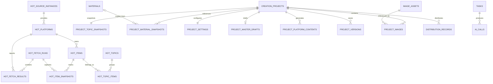

# 数据模型

> 状态：首版草案  
> 最近更新：2026-07-12

## 1. 存储原则

- 使用 SQLite、better-sqlite3 和 Drizzle ORM，数据库开启 WAL。
- 数据库只由 Electron 主进程访问。
- Schema 使用 TypeScript 定义，应用启动时执行编号迁移。
- 项目保存版本、删除和恢复等跨表写入必须使用事务。
- 可查询和需要约束的业务数据使用关系表；平台可变字段和版本快照允许使用 JSON。
- 时间统一保存 UTC，界面按 Asia/Hong_Kong 显示。
- 主键使用应用生成的字符串 ID，不依赖 SQLite 自增 ID 暴露给业务层。

## 2. 核心实体

### 2.1 热点

| 表 | 用途 | 关键字段 |
|---|---|---|
| `hot_source_instances` | 热点源实例；首版只有 NewsNow | type、name、base_url、enabled |
| `hot_platforms` | 数据源中的平台 | source_id、platform_key、name、expected_domain |
| `hot_fetch_runs` | 一次用户手动刷新 | started_at、finished_at、status |
| `hot_fetch_results` | 每次刷新中各平台的结果 | run_id、platform_id、status、error、is_cached |
| `hot_items` | 标准化后的原始热点 | platform_id、normalized_url、current_title、first_seen_at、last_seen_at |
| `hot_item_snapshots` | 某次刷新时的排名和热度 | item_id、run_id、rank、heat_value、title、captured_at |
| `hot_topics` | 本地候选或 AI 聚合后的热点主题 | title、summary、status、first_seen_at、last_seen_at |
| `hot_topic_items` | 聚合主题与原始热点的关联 | topic_id、item_id、confidence、confirmed_by_ai |

### 2.2 素材

| 表 | 用途 | 关键字段 |
|---|---|---|
| `materials` | 素材库原文 | title、body、tags_text、created_at、updated_at、last_used_at |

标签使用自由文本，不建立独立标签表。

### 2.3 创作

| 表 | 用途 | 关键字段 |
|---|---|---|
| `creation_projects` | 创作项目基础信息 | name、topic_type、status、created_at、updated_at |
| `project_topic_snapshots` | 自定义主题或热点主题快照 | project_id、title、summary、source_details_json |
| `project_material_snapshots` | 项目绑定的素材内容快照 | project_id、source_material_id、title、body、tags_text、priority |
| `project_settings` | 当前编辑稿的统一创作设置 | project_id、audience、style、length、stance、marketing_goal、selected_platforms_json |
| `project_master_drafts` | 当前编辑稿中的母稿 | project_id、content_json、plain_text、generation_status |
| `project_platform_contents` | 当前编辑稿中的平台内容 | project_id、platform、content_json、generation_status、updated_at |
| `project_versions` | 用户主动保存的整体项目快照 | project_id、sequence、snapshot_json、created_at |

`project_versions` 每个项目最多保留两条。自动保存只更新当前编辑稿相关表，不创建版本；点击“保存版本”时序列化整个项目状态。

### 2.4 图片

| 表 | 用途 | 关键字段 |
|---|---|---|
| `image_assets` | 本地图片文件资产 | file_path、file_hash、mime_type、width、height、size_bytes |
| `project_images` | 当前编辑稿中的图片引用 | project_id、platform、purpose、ratio、asset_id、prompt、sort_order、note、paragraph_anchor |

- 封面通过项目、平台、用途和比例的唯一约束保证每种规格只有一张。
- 内容配图允许多张，通过 `sort_order` 排序，可选使用 `paragraph_anchor` 绑定正文位置。
- 版本快照保存图片资产 ID；当前编辑稿、当前版本和上一版本都不再引用后，才删除物理文件。

### 2.5 分发

| 表 | 用途 | 关键字段 |
|---|---|---|
| `distribution_records` | 项目下各平台的分发任务 | project_id、platform、status、copied_at、published_at、published_url、content_changed_after_publish |

分发页读取当前自动保存编辑稿。编辑稿尚未主动保存版本时，页面显示提示，但不阻止复制。

### 2.6 AI、任务和统计

| 表 | 用途 | 关键字段 |
|---|---|---|
| `tasks` | 持久化任务队列 | type、status、payload_json、progress、retry_count、error_code、error_message |
| `ai_calls` | AI 请求元数据 | task_id、feature、model、duration_ms、input_tokens、output_tokens、status |
| `daily_token_usage` | 每日 Token 汇总 | usage_date、input_tokens、output_tokens、total_tokens |

`daily_token_usage` 为历史事实统计，不因项目删除而回退。

### 2.7 设置与日志

| 表 | 用途 | 关键字段 |
|---|---|---|
| `app_settings` | 非敏感应用配置 | key、value_json、updated_at |
| `operation_logs` | 用户操作日志 | level、module、action、summary、created_at |
| `error_logs` | 错误及堆栈 | module、error_code、message、stack、created_at |

API Key 不进入数据库，使用 Electron safeStorage 加密后单独保存。

## 3. 主要关系

## 4. 删除与快照规则

### 删除创作项目

- 事务内删除项目设置、母稿、平台内容、版本、素材快照、热点快照、图片引用和分发记录。
- 删除引用后清理引用数为零的图片资产及本地文件。
- Token 日统计继续保留。
- 日志保存项目名称文本快照，不保留强制项目外键。

### 复制创作项目

- 新项目复制当前编辑状态、热点快照、素材快照、平台内容和图片资产引用。
- 不复制 `project_versions` 和 `distribution_records`。
- 图片资产文件不重复拷贝，只增加引用；副本替换图片不修改原项目引用。

### 素材快照

- 项目选择素材时复制标题、正文、标签和参考优先级。
- 素材库原文修改或删除不会改变项目快照。
- 用户重新选择素材时才更新项目快照。

### 热点快照

- 热点创建项目时复制聚合标题、摘要、来源、原始标题、链接、排名和当时热度。
- 热点更新或清理不会改变已有项目。

## 5. 首批索引与约束

- `hot_items(platform_id, normalized_url)`：有 URL 时唯一。
- `hot_item_snapshots(item_id, run_id)`：唯一。
- `hot_fetch_results(run_id, platform_id)`：唯一。
- `hot_topic_items(topic_id, item_id)`：唯一。
- `project_platform_contents(project_id, platform)`：唯一。
- `distribution_records(project_id, platform)`：唯一。
- `daily_token_usage(usage_date)`：唯一。
- 热点标题、素材标题/正文和项目名称使用 SQLite FTS5 trigram 索引。
- 3 个及以上字符使用 trigram 子串匹配；1～2 个字符使用限制范围和返回数量的 LIKE 查询。
- 业务表写入与 FTS 索引更新放在同一事务中。
- 后续需要中文词语权重和语义排序时，可增加中文分词器，不更换 SQLite。
- 所有外键启用 SQLite foreign keys，明确使用 CASCADE、RESTRICT 或 SET NULL。

## 6. 待细化

- 每张表的完整字段类型和默认值。
- `snapshot_json` 的版本号和 Zod Schema。
- 热点热度值在不同平台间的标准化方法。
- 富文本段落锚点的稳定生成规则。
- 备份恢复时数据库 Schema 与快照 Schema 的兼容策略。
